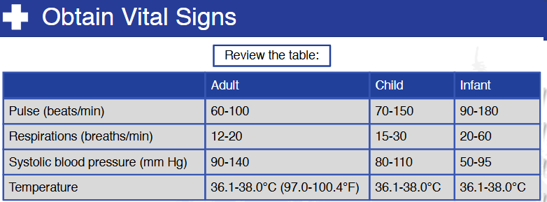

# Nsp Oec Training Chapter 7 - National Ski Patrol - Outdoor Emergency Care chapter 7
National Ski Patrol - Outdoor Emergency Care chapter 7

Chapter 7 - Patient Assessment

1. Explain and demonstrate the five parts of a patient assessment.
2. Describe the importance of controlling major bleeding as a first step during the primary patient assessment.
3. Describe the first steps you take when you encounter a patient who is responsive.
4. Explain how the ABCD's are used in assessing a patient.
5. Describe the difference between a sign and a symptom.
6. Demonstrate how to assess the pupils.
7. Demonstrate how to assess eye movement.
8. List the normal vital signs for an infant, child, and adult.
9. Demonstrate where you can take five pulses in five different locations on the body.
10. Describe and demonstrate how to assess vital signs.

7.1 Explain and demonstrate the five parts of a patient assessment.

1. Scene Size-up: Ensure the scene is safe and identify the mechanism of injury or nature of illness.
2. Primary Patient Assessment: Assess and stabilize life-threatening conditions by checking airway, breathing, and circulation.
3. History Taking: Gather the patient's medical history, including present illness, past conditions, medications, and allergies.
4. Secondary Patient Assessment: Conduct a detailed head-to-toe physical examination to identify other injuries or conditions.
5. Reassessment: Continuously monitor the patient's vital signs and response to interventions to detect changes in their condition.

7.4. Explain how the ABCD's are used in assessing a patient.

The ABCD framework is commonly used in healthcare to assess various conditions, particularly when evaluating
aspects like pain, injury, and overall patient stability. The ABCD approach ensures that critical, life-threatening 
issues are identified and addressed promptly in an emergency or clinical situation.

Here's a brief explanation:

A - Airway:

Check if the patient's airway is clear and unobstructed.
Ensure the patient can breathe and speak normally without difficulty.
Any blockages (like swelling or foreign objects) need immediate attention.

B - Breathing:

Assess the patient's ability to breathe effectively.
Look for signs of respiratory distress (e.g., labored breathing, irregular breaths).
Check oxygen levels and respiratory rate.

C - Circulation:

Evaluate the patient's blood circulation, including heart rate, blood pressure, and skin color.
Look for signs of poor circulation such as cold, clammy skin, or weak pulse.
Assess for any bleeding or shock symptoms.

D - Disability:

Quickly assess the patient's neurological status.
Use tools like the AVPU scale (Alert, Verbal, Pain, Unresponsive) to determine consciousness level.
Check for any significant injuries or other conditions affecting motor function.

## Getting Started
To get started with the **Nsp Oec Training Chapter 7** solution repository, follow these steps:
1. Clone the repository to your local machine.
2. Install the required dependencies listed at the top of the notebook.
3. Explore the example code provided in the repository and experiment.
4. Run the notebook and make it your own - **EASY !**
    
## Solution Features
- Easy to understand and use  
- Easily Configurable 
- Quickly start your project with pre-built templates
- Its Fast and Automated

## Notebook Features
- **Self Documenting** - Automatically identifes major steps in notebook 
- **Self Testing** - Unit Testing for each function
- **Easily Configurable** - Easily modify with **config.INI** - keyname value pairs
- **Includes Talking Code** - The code explains itself 
- **Self Logging** - Enhanced python standard logging   
- **Self Debugging** - Enhanced python standard debugging
- **Low Code** - or - No Code  - Most solutions are under 50 lines of code
- **Educational** - Includes educational dialogue and background material
    
## Deliverables or Figures
                   
    

## Github    
## https://github.com/JoeEberle/ 

## Email 
## josepheberle@outlook.com 

    

    