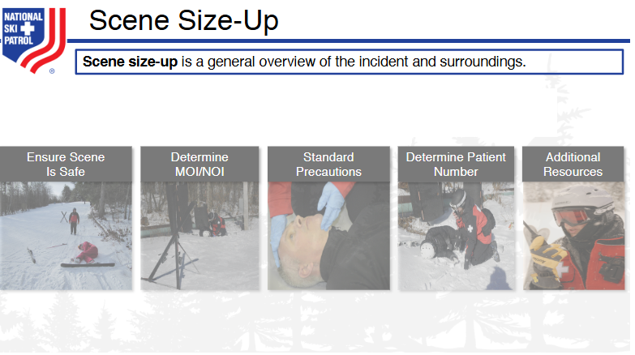

# Nsp Oec Training Chapter 7 - National Ski Patrol - Outdoor Emergency Care chapter 7
Chapter 7 - Patient Assessment

1. Explain and demonstrate the five parts of a patient assessment.
2. Describe the importance of controlling major bleeding as a first step during the primary patient assessment.
3. Describe the first steps you take when you encounter a patient who is responsive.
4. Explain how the ABCD's are used in assessing a patient.
5. Describe the difference between a sign and a symptom.
6. Demonstrate how to assess the pupils.
7. Demonstrate how to assess eye movement.
8. List the normal vital signs for an infant, child, and adult.
9. Demonstrate where you can take five pulses in five different locations on the body.
10. Describe and demonstrate how to assess vital signs.

## 7.1 Explain and demonstrate the five parts of a patient assessment.

1. **Scene Size-up**: Ensure the scene is safe and identify the mechanism of injury or nature of illness.
2. **Primary Patient Assessment**: Assess and stabilize life-threatening conditions by checking airway, breathing, and circulation.
3. **History Taking**: Gather the patient's medical history, including present illness, past conditions, medications, and allergies.
4. **Secondary Patient Assessment**: Conduct a detailed head-to-toe physical examination to identify other injuries or conditions.
5. **Reassessment**: Continuously monitor the patient's vital signs and response to interventions to detect changes in their condition.

## 7.2  Controlling major bleeding as a first step.

Controlling major bleeding is a critical first step in patient assessment during emergency care. If severe bleeding is present, it takes priority over other assessments, as uncontrolled hemorrhage can quickly lead to shock or death. The responder should immediately apply direct pressure to the wound using a clean dressing or cloth. If bleeding persists, a tourniquet may be applied above the injury (on limbs), or additional dressings may be used to maintain pressure. Once the bleeding is under control, the responder can continue with the full patient assessment, including airway, breathing, and circulation (ABC).

Controlling major bleeding during the primary patient assessment is crucial because uncontrolled hemorrhage is one of the leading causes of preventable death in trauma situations. If major bleeding is not addressed immediately, the patient can go into shock due to rapid blood loss, leading to organ failure and death within minutes. Here's why it's vital:

1. **Prevent Hypovolemic Shock**: Excessive blood loss reduces the amount of oxygenated blood that can be delivered to the body’s organs. This can lead to shock, organ failure, and death.

2. **Maintain Circulation**: Blood is necessary for carrying oxygen to the tissues. Without it, critical systems, like the brain and heart, cannot function properly.

3. **Time-Sensitive Action**: In severe cases, such as arterial bleeding, a person can bleed out within minutes. Stopping or controlling the bleeding can buy crucial time for further medical intervention.

4. **Prioritization in ABCs (Airway, Breathing, Circulation)**: While securing the airway and breathing are also vital steps in primary assessment, hemorrhage control is often prioritized because blood loss can lead to death faster than issues related to breathing in some trauma cases.

Immediate actions like applying pressure, using a tourniquet, or packing a wound can make the difference between life and death before further medical care is provided.

## 7.3  Describe the first steps you take when you encounter a patient who is responsive.

When encountering a responsive patient, the first steps to take are as follows:

Ensure Scene Safety: Before approaching the patient, ensure that the scene is safe for both you and the patient to prevent further harm.

Introduce Yourself and Gain Consent: Approach the patient calmly, introduce yourself as a trained responder, and ask for their consent to provide care. For example, say, "I’m trained in first aid. Can I help you?"

Assess the Level of Responsiveness: Use the AVPU scale to quickly evaluate the patient's responsiveness:

Alert: Is the patient fully awake and aware?
Verbal: Does the patient respond to verbal stimuli?
Pain: Does the patient respond to painful stimuli?
Unresponsive: No response to stimuli.
Perform a Quick Primary Assessment (ABC):

Airway: Check if the patient’s airway is open and clear.
Breathing: Ensure the patient is breathing adequately.
Circulation: Check for any major bleeding or circulation issues.
Assess for Life-Threatening Conditions: Quickly scan for any obvious signs of severe injury or bleeding, and take immediate steps if necessary, such as controlling major bleeding.

Conduct a Secondary Assessment: Once the patient’s immediate needs are addressed, ask about the patient’s symptoms and history (SAMPLE: Symptoms, Allergies, Medications, Past medical history, Last meal, Events leading up to the injury/illness) and perform a more detailed physical exam if needed.

These steps ensure the responder provides appropriate care while focusing on the patient’s immediate safety and condition.

## 7.4 ABCD framework - Explain how the ABCD's are used in assessing a patient

The ABCD framework is commonly used in healthcare to assess various conditions, particularly when evaluating
aspects like pain, injury, and overall patient stability. The ABCD approach ensures that critical, life-threatening 
issues are identified and addressed promptly in an emergency or clinical situation.

Here's a brief explanation:

1. **A - Airway**: Check if the patient's airway is clear and unobstructed.
Ensure the patient can breathe and speak normally without difficulty.
Any blockages (like swelling or foreign objects) need immediate attention.

2. **B - Breathing**: Assess the patient's ability to breathe effectively.
Look for signs of respiratory distress (e.g., labored breathing, irregular breaths).
Check oxygen levels and respiratory rate.

3. **C - Circulation**: Evaluate the patient's blood circulation, including heart rate, blood pressure, and skin color.
Look for signs of poor circulation such as cold, clammy skin, or weak pulse.
Assess for any bleeding or shock symptoms.

4. **D - Disability**: Quickly assess the patient's neurological status.
Use tools like the AVPU scale (Alert, Verbal, Pain, Unresponsive) to determine consciousness level.
Check for any significant injuries or other conditions affecting motor function.

## OPQRST mnemonic, commonly used to assess a patient's symptoms: 

Here’s a list explaining the OPQRST mnemonic, commonly used to assess a patient's symptoms during a medical emergency, especially pain:

1. **O - Onset**: Ask, "When did the pain start?" and "What were you doing when it began?"
2. **P - Provocation/Palliation**: Ask, "What makes the pain better or worse?" (e.g., movement, pressure, rest).
3. **Q - Quality**: Ask, "Can you describe the pain?" (e.g., sharp, dull, stabbing, burning).
4. **R - Region/Radiation**: Ask, "Where is the pain located?" and "Does it move to other areas?"
5. **S - Severity**: Ask, "On a scale of 1 to 10, how intense is the pain?" (10 being the worst).
6. **T - Time**: Ask, "How long has the pain lasted?" and "Has it changed over time?"

This mnemonic helps to systematically gather important details about the patient's condition.

## AVPU scale

The AVPU scale is a quick tool used to assess a patient's level of consciousness. It evaluates their responsiveness and can help determine the severity of a patient's condition. Here's what it stands for:

1. **A - Alert**: The patient is fully awake and aware of their surroundings, and can respond appropriately to questions.
2. **V - Verbal**: The patient responds to verbal stimuli, but may not be fully awake or oriented.
3. **P - Pain**: The patient responds only to painful stimuli, such as a pinch or pressure.
4. **U - Unresponsive**: The patient shows no response to verbal or painful stimuli and is unconscious.

The AVPU scale is commonly used in emergency situations to quickly assess the patient’s neurological status.

Here’s a brief description of each letter in the DCAP-BTLS mnemonic:

1. D - **Deformities**:  Visible or palpable abnormal shapes or alignment of body parts.
2. C - **Contusions**: Bruises or discoloration caused by blood collecting under the skin.
3. A - **Abrasions**: Scrapes or damage to the surface of the skin, as in the case of the scraped knee.
4. P - **Punctures/Penetrations**: Holes or deep injuries caused by a sharp object or force.
5. B - **Burns:** Damage to the skin or deeper tissues caused by heat, chemicals, electricity, or radiation.
6. T - **Tenderness**: Pain or discomfort when an area of the body is touched or palpated.
7. L - **Lacerations**: Deep cuts or tears in the skin or tissue.
8. S - **Swelling**: Enlargement of body tissues due to fluid accumulation, often indicating injury or inflammation.

This mnemonic is used during a physical examination to identify specific injuries.

## 7.6 Assessing a patient's pupils is an important part of the neurological assessment

Assessing a patient's pupils is an important part of the neurological assessment to determine brain function and possible injury. The acronym **PERRLA** is often used, which stands for **Pupils Equal, Round, and Reactive to Light and Accommodation**. Here’s a step-by-step guide to assess the pupils:

### 1. **Prepare the Environment**
   - Dim the room slightly if possible, to make it easier to assess the reaction of the pupils to light.

### 2. **Explain the Procedure**
   - Inform the patient that you will be shining a light in their eyes and that this is part of the exam to check their neurological function.

### 3. **Inspect the Pupils for Size and Shape**
   - Stand in front of the patient.
   - Look at the pupils for equality and roundness.
     - **Normal pupils**: Both pupils should be the same size (equal) and round in shape.
     - **Anisocoria**: If the pupils are of different sizes, this condition could be natural in some people, but it could also indicate a neurological problem if accompanied by other symptoms.
     - **Abnormal shapes**: Irregularly shaped pupils might suggest eye trauma or neurological damage.

### 4. **Test Reaction to Light**
   - Using a small flashlight (penlight), shine the light briefly into each eye:
     - **Direct Response**: Shine the light in one eye and observe the constriction (narrowing) of the pupil. It should constrict quickly.
     - **Consensual Response**: While shining the light in one eye, the other eye should also constrict at the same time. This is known as a consensual response.
     - **Normal reaction**: Both pupils should constrict when exposed to light, either directly or consensually.
   
### 5. **Check for Accommodation**
   - Ask the patient to focus on a distant object, then shift their gaze to a close object (like your finger held a few inches from their nose).
     - **Normal accommodation**: The pupils should constrict when focusing on a near object and dilate when focusing on a distant one.

### 6. **Document Your Findings**
   - After assessing the pupils, document whether the pupils were **PERRLA**:
     - **Pupils Equal**
     - **Round**
     - **Reactive to Light**
     - **Reactive to Accommodation**
   - If any abnormalities were found, note the differences and describe them in detail.

### Signs to Watch For:
- **Non-reactive or sluggish pupils**: Could indicate brain injury or increased intracranial pressure.
- **Fixed and dilated pupils**: May suggest severe brain injury or the use of certain medications or drugs.
- **Constricted pupils (miosis)**: Could indicate opioid use or damage to the parasympathetic nervous system.

Pupil assessment can give insight into the patient's overall neurological condition and help determine the next steps in their care.

## 7.7 Assessing eye movement is an important part of a neurological examination. It helps determine the function of the cranial nerves that control eye movements (cranial nerves III, IV, and VI) and can reveal possible issues such as nerve damage, muscle weakness, or brain injury. Here’s how to conduct an eye movement assessment:

### 1. **Explain the Procedure to the Patient**
   - Inform the patient that you will be checking their eye movements by having them follow an object or your finger without moving their head.

### 2. **Position the Patient**
   - Have the patient sit or lie in a comfortable position.
   - Ask the patient to keep their head still and only move their eyes to follow your instructions.

### 3. **Use a Target**
   - Use your finger, a pen, or a small object as a target for the patient to follow.
   - Position yourself about 12-18 inches (30-45 cm) in front of the patient’s face, where they can comfortably see your hand.

### 4. **Instruct the Patient to Follow the Target**
   - Ask the patient to follow the target with just their eyes, without moving their head.
   - Move the target slowly and smoothly in specific patterns to assess different types of eye movements:

### 5. **Assess Horizontal, Vertical, and Diagonal Movements**
   - **Horizontal Movement**: Move the target to the right and then to the left. Both eyes should move smoothly in the same direction.
   - **Vertical Movement**: Move the target up and then down. Both eyes should move together smoothly.
   - **Diagonal Movement**: Move the target diagonally (top right to bottom left, and vice versa). The eyes should follow in unison.

### 6. **Assess the Six Cardinal Directions of Gaze**
   - Move the target in an "H" or a "star" pattern to assess the six cardinal directions of gaze. These directions are controlled by different eye muscles, and testing them can reveal specific muscle or nerve dysfunction:
     - Upward and outward
     - Upward and inward
     - Directly outward (to both sides)
     - Downward and outward
     - Downward and inward
   - Watch for smooth, coordinated eye movement in each direction. Both eyes should move together without any jerky or skipping motions.

### 7. **Look for Abnormal Findings**
   - **Nystagmus**: Involuntary, jerky movements of the eyes, which may suggest a neurological problem or issues with the inner ear.
   - **Strabismus**: Misalignment of the eyes, where one eye might not follow the other.
   - **Limited Movement**: Inability to move the eyes in certain directions, which could indicate cranial nerve damage or muscle weakness.

### 8. **Check for Convergence**
   - Move the target slowly toward the patient's nose. Both eyes should converge (move inward) as the object gets closer.

### 9. **Document Your Findings**
   - Note if the eye movements were smooth and symmetrical in all directions. Document any abnormalities, such as nystagmus, limited range of motion, or inability to move the eyes in specific directions.

### Signs to Watch For:
- **Nystagmus**: May indicate issues with the cerebellum, brainstem, or inner ear.
- **Ophthalmoplegia**: Weakness or paralysis of the eye muscles, potentially indicating cranial nerve palsies.
- **Convergence insufficiency**: Difficulty with near vision tasks could point to muscle weakness or neurological issues.

By assessing eye movements, you gain valuable information about the function of the cranial nerves and the brain, helping to identify potential neurological problems.

7.8 List the normal vital signs for an infant, child, and adult.

Here is a breakdown of the normal vital signs for an **infant**, **child**, and **adult**, including heart rate, respiratory rate, blood pressure, and temperature:

### 1. **Infant (0-12 months)**
   - **Heart Rate (Pulse)**: 100-160 beats per minute (bpm)
   - **Respiratory Rate**: 30-60 breaths per minute
   - **Blood Pressure**: 70-100 mmHg systolic (exact ranges vary based on age and size)
   - **Temperature**: 97.9°F - 100.4°F (36.6°C - 38°C) (rectal temperature is typically used)

### 2. **Child (1-12 years)**
   - **Heart Rate (Pulse)**:
     - 1-3 years: 90-150 bpm
     - 4-5 years: 80-140 bpm
     - 6-12 years: 70-120 bpm
   - **Respiratory Rate**:
     - 1-5 years: 20-30 breaths per minute
     - 6-12 years: 18-25 breaths per minute
   - **Blood Pressure**:
     - 1-3 years: 80-110 mmHg systolic
     - 4-5 years: 80-115 mmHg systolic
     - 6-12 years: 90-120 mmHg systolic
   - **Temperature**: 98.6°F (37°C) (oral or axillary temperatures are commonly used)

### 3. **Adult (13+ years)**
   - **Heart Rate (Pulse)**: 60-100 bpm
   - **Respiratory Rate**: 12-20 breaths per minute
   - **Blood Pressure**: 90-120 mmHg systolic / 60-80 mmHg diastolic
   - **Temperature**: 98.6°F (37°C) (oral temperature)

### Notes:
- **Heart Rate**: Infants and young children typically have higher heart rates compared to adults due to their higher metabolic rates.
- **Respiratory Rate**: Infants and children breathe faster than adults.
- **Blood Pressure**: Blood pressure increases with age, as blood vessels develop more resistance.
- **Temperature**: Normal body temperature remains fairly consistent across all ages, with small variations depending on the method of measurement.

## 7.9 Five locations on the body where you can take a pulse

Here are five locations on the body where you can take a pulse, along with instructions on how to palpate each one:

### 1. **Radial Pulse (Wrist)**
   - **Location**: On the thumb side of the inner wrist, just below the base of the thumb.
   - **How to Palpate**: 
     - Use the pads of your index and middle fingers.
     - Place your fingers lightly over the radial artery (just beneath the skin).
     - Press gently until you feel the pulse.
   - **Common Use**: This is the most common site for checking pulse in routine exams.

### 2. **Carotid Pulse (Neck)**
   - **Location**: Along the side of the neck, just beside the trachea (windpipe) and below the jawline.
   - **How to Palpate**: 
     - Place your index and middle fingers gently on either side of the neck, in the groove between the trachea and the large neck muscles (sternocleidomastoid).
     - Press lightly until you feel the pulse.
   - **Common Use**: Often used in emergencies or when the radial pulse is weak or absent.

### 3. **Brachial Pulse (Arm)**
   - **Location**: On the inner side of the arm, just above the elbow crease.
   - **How to Palpate**: 
     - Extend the patient’s arm and turn the palm upward.
     - Place your index and middle fingers in the crease of the elbow, slightly toward the inside of the arm.
     - Press gently until you feel the brachial artery pulse.
   - **Common Use**: This is frequently used in infants or for measuring blood pressure with a stethoscope.

### 4. **Femoral Pulse (Groin)**
   - **Location**: In the groin area, where the leg meets the lower abdomen.
   - **How to Palpate**: 
     - Place your index and middle fingers midway between the pubic bone and the hip bone.
     - Press down firmly until you feel the femoral artery pulse.
   - **Common Use**: Used in trauma assessments or when checking circulation in the legs.

### 5. **Dorsalis Pedis Pulse (Foot)**
   - **Location**: On the top of the foot, just in front of the ankle.
   - **How to Palpate**: 
     - Use your index and middle fingers to feel along the top of the foot, between the first and second metatarsal bones (the long bones of the foot).
     - Press gently until you feel the pulse.
   - **Common Use**: This is used to assess circulation in the lower extremities, especially in patients with diabetes or vascular disease.

### Summary of Locations:
1. **Radial Pulse** – Wrist (thumb side)
2. **Carotid Pulse** – Neck (next to trachea)
3. **Brachial Pulse** – Inner arm (above the elbow)
4. **Femoral Pulse** – Groin (where leg meets abdomen)
5. **Dorsalis Pedis Pulse** – Top of the foot (near ankle)

By checking pulses in different locations, you can assess blood flow and circulatory function in various parts of the body.

## 7.10   Describe and demonstrate how to assess vital signs.
 
 Assessing vital signs is a critical part of a patient’s assessment to monitor their overall health and detect any potential medical issues. Vital signs include **heart rate (pulse)**, **respiratory rate**, **blood pressure**, and **temperature**. Additionally, **oxygen saturation (SpO2)** and **pain levels** are often considered.

Here is a step-by-step guide on how to assess each of the vital signs:

---

### 1. **Heart Rate (Pulse)**
   - **Location**: Common pulse points include the radial artery (wrist), carotid artery (neck), or brachial artery (inner arm).
   - **How to Assess**:
     - Use the pads of your index and middle fingers (do not use your thumb).
     - Place your fingers on the pulse point and count the beats for 30 seconds, then multiply by 2 to get the heart rate in beats per minute (bpm).
     - If the pulse is irregular, count for the full 60 seconds to get an accurate reading.
   - **Normal Range**:
     - **Adults**: 60-100 bpm
     - **Children**: 70-120 bpm
     - **Infants**: 100-160 bpm

---

### 2. **Respiratory Rate**
   - **How to Assess**:
     - Without telling the patient (to avoid altering their breathing pattern), observe the rise and fall of the chest.
     - Count the number of breaths for 30 seconds and multiply by 2 to get breaths per minute.
     - Note whether the breathing is regular, labored, or shallow.
   - **Normal Range**:
     - **Adults**: 12-20 breaths per minute
     - **Children**: 18-25 breaths per minute
     - **Infants**: 30-60 breaths per minute

---

### 3. **Blood Pressure**
   - **Equipment**: Use a **sphygmomanometer** (blood pressure cuff) and a **stethoscope**, or an automated blood pressure machine.
   - **How to Assess**:
     1. Wrap the cuff snugly around the upper arm, aligning the artery marker with the brachial artery (inside of the arm, near the elbow).
     2. Place the stethoscope on the brachial artery.
     3. Inflate the cuff until the pressure is about 30 mmHg above the point where you no longer hear the pulse.
     4. Slowly deflate the cuff while listening to the pulse.
     5. Record the pressure where you first hear the pulse (systolic pressure) and where the sound disappears (diastolic pressure).
   - **Normal Range**:
     - **Adults**: 90-120 mmHg systolic / 60-80 mmHg diastolic
     - **Children**: 80-120 mmHg systolic / 50-80 mmHg diastolic
     - **Infants**: 70-100 mmHg systolic

---

### 4. **Temperature**
   - **Equipment**: Use a **digital thermometer** for oral, rectal, axillary (underarm), or tympanic (ear) measurement.
   - **How to Assess**:
     - For an **oral reading**, place the thermometer under the tongue and wait for the beep (or for the indicated time) to record the reading.
     - For an **axillary reading**, place the thermometer in the armpit and hold the arm down until the temperature stabilizes.
     - For a **tympanic reading**, gently insert the thermometer into the ear canal following the device’s instructions.
   - **Normal Range**:
     - **Oral**: 98.6°F (37°C)
     - **Rectal**: 99.6°F (37.5°C)
     - **Axillary**: 97.6°F (36.5°C)
     - **Tympanic**: 98.6°F (37°C)

---

### 5. **Oxygen Saturation (SpO2)**
   - **Equipment**: Use a **pulse oximeter**.
   - **How to Assess**:
     - Place the pulse oximeter on the patient's fingertip, earlobe, or toe.
     - Wait for the reading to stabilize and display the oxygen saturation percentage.
   - **Normal Range**:
     - **Adults and Children**: 95-100%
     - Levels below 90% are considered low and may require medical attention.

---

### 6. **Pain Level (Subjective)**
   - **How to Assess**:
     - Ask the patient to rate their pain on a scale from 0 to 10, with 0 being no pain and 10 being the worst pain imaginable.
     - Document the location, duration, and nature (sharp, dull, throbbing) of the pain.
   - **Normal Range**: 0 (No pain)

---

### Summary of Normal Ranges:
| Vital Sign             | Infant (0-12 months)  | Child (1-12 years)   | Adult (13+ years)      |
|------------------------|-----------------------|----------------------|------------------------|
| **Heart Rate (bpm)**    | 100-160               | 70-120               | 60-100                 |
| **Respiratory Rate (rpm)** | 30-60               | 18-25                | 12-20                  |
| **Blood Pressure (mmHg)** | 70-100 systolic      | 80-120 systolic      | 90-120 systolic        |
| **Temperature (°F)**    | 97.9-100.4 (rectal)   | 98.6 (oral)          | 98.6 (oral)            |
| **Oxygen Saturation**   | 95-100%               | 95-100%              | 95-100%                |

---

This guide covers the six key aspects of vital signs assessment, giving you a comprehensive understanding of how to evaluate and document a patient's health status effectively.
 
 
 
 ## Key Terms 
 1. **Allergy** - An abnormal immune response to certain substances, such as food, medication, or environmental factors, causing symptoms like rash, swelling, or difficulty breathing. 
  2. **AVPU scale** - A quick assessment method to evaluate a patient's level of responsiveness: Alert, Verbal, Pain, Unresponsive. 
  3. **Blood Pressure** - The pressure of circulating blood against the walls of blood vessels, measured as systolic over diastolic pressure. 
  4. **Breath Sounds** - Sounds heard through a stethoscope placed on the chest that can help assess lung function and detect abnormalities. 
  5. **Chief Complaint** - The primary symptom or concern expressed by a patient during medical assessment, usually the reason for seeking medical care. 
  6. **DCAP-BTLS** - A mnemonic used to assess trauma patients: Deformities, Contusions, Abrasions, Punctures/Penetrations, Burns, Tenderness, Lacerations, and Swelling. 
  7. **Decerebrate Posturing** - An abnormal body posture that involves the arms and legs being held straight out, and toes pointed downward, indicating severe brain damage. 
  8. **Decorticate Posturing** - An abnormal posture in which a person is stiff with bent arms, clenched fists, and legs held out straight, often indicating damage to the brain. 
  9. **General Impression** - The initial overall assessment of a patient's condition based on appearance, behavior, and how they present. 
  10. **Level of Responsiveness** - An evaluation of a patient's alertness and ability to respond to stimuli, often using the AVPU scale. 
  11. **Mechanism of Injury** - The method by which damage (trauma) to the body occurs, such as a fall, car accident, or blunt force. 
  12. **Nature of Illness** - The underlying cause or medical condition responsible for a patient's symptoms. 
  13. **OPQRST** - A mnemonic for assessing pain: Onset, Provocation/Palliation, Quality, Region/Radiation, Severity, Time. 
  14. **Palpation** - The act of examining the body by touch, particularly to assess for tenderness, swelling, or abnormalities. 
  15. **Paraesthesia** - A sensation of tingling, prickling, or numbness, often described as 'pins and needles.' 
  16. **Patient Assessment** - A systematic evaluation of a patient's condition, including primary and secondary assessments. 
  17. **PERRL** - A mnemonic used to assess pupils: Pupils Equal, Round, and Reactive to Light. 
  18. **Primary Patient Assessment** - The initial assessment focused on identifying and addressing life-threatening conditions. 
  19. **Pulse** - The rhythmic throbbing of arteries as blood is propelled through them, typically felt at the wrist or neck. 
  20. **Pulse Oximeter** - A device used to measure the oxygen saturation level in the blood. 
  21. **SAMPLE** - A mnemonic used for obtaining a patient history: Signs/Symptoms, Allergies, Medications, Past medical history, Last oral intake, Events leading to illness or injury. 
  22. **Scene Safety** - The process of ensuring the safety of the medical responders and patient before providing care. 
  23. **Scene Size-up** - The initial evaluation of the scene to identify potential hazards, mechanism of injury, and number of patients. 
  24. **Secondary Patient Assessment** - A thorough, head-to-toe physical examination performed after the primary assessment. 
  25. **Sign** - An objective finding during a medical examination, such as a rash or swelling. 
  26. **Symptom** - A subjective experience reported by the patient, such as pain or dizziness. 
  27. **Vital Signs** - Measurements of the body's essential functions, including heart rate, respiratory rate, blood pressure, and temperature. 
 
## Getting Started

The goal of this solution is to **Jump Start** your development and have you up and running in 30 minutes. 

To get started with the **Nsp Oec Training Chapter 7** solution repository, follow these steps:
1. Clone the repository to your local machine.
2. Install the required dependencies listed at the top of the notebook.
3. Explore the example code provided in the repository and experiment.
4. Run the notebook and make it your own - **EASY !**
    
## Solution Features
- Easy to understand and use  
- Easily Configurable 
- Quickly start your project with pre-built templates
- Its Fast and Automated

## Notebook Features

These Features are design to provide everything you need for **Knowledge Transfer** 

- **Self Documenting** - Automatically identifes major steps in notebook 
- **Self Testing** - Unit Testing for each function
- **Easily Configurable** - Easily modify with **config.INI** - keyname value pairs
- **Includes Talking Code** - The code explains itself 
- **Self Logging** - Enhanced python standard logging   
- **Self Debugging** - Enhanced python standard debugging
- **Low Code** - or - No Code  - Most solutions are under 50 lines of code
- **Educational** - Includes educational dialogue and background material
    
## List of Figures
                   
    

## Github https://github.com/JoeEberle/ - Email  josepheberle@outlook.com 
    

    